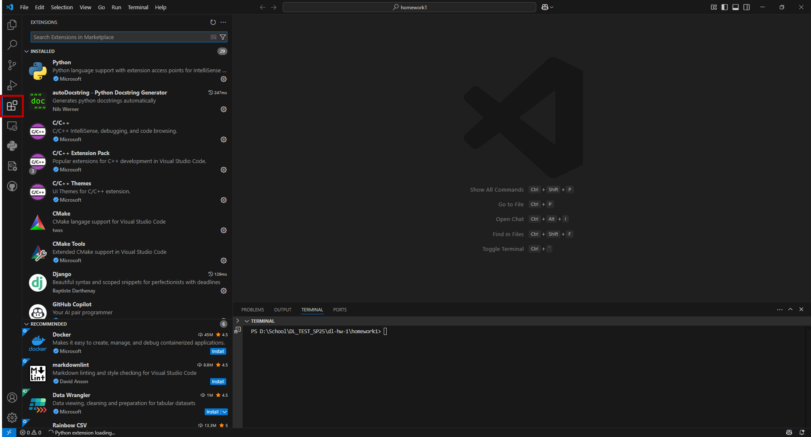
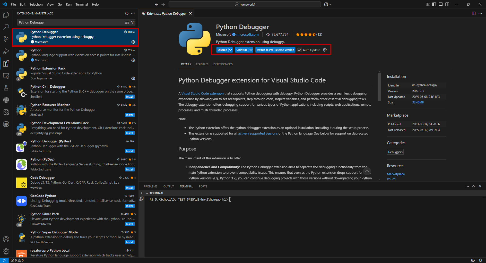

# VSCode Python Debugger Setup  :snake:
Instructions and configuration files for setting up the Python debugger in VSCode

## Table Of Contents

- [Getting Started](#getting-started)
    - [Prerequisites](#prerequisites)
    - [Installation](#installation)
- [Configurations](#configurations)
    - [Command Line Debugger](#command-line-debugger)
    - [Notebook Debugger](#notebook-debugger)
    - [Remote Debugger](#remote-debugger)

## Getting Started
### Prerequisites
Make sure to have the following programs installed:
| Requirement                             | Installation                         |
| --------------------------------------- | ------------------------------------ |
| VSCode                                  | https://code.visualstudio.com/download      |
| Miniconda (Optional)                    | https://www.anaconda.com/docs/getting-started/miniconda/install#quickstart-install-instructions |
| Colab Pro (Optional)                    | https://www.anaconda.com/docs/getting-started/miniconda/install#quickstart-install-instructions |

### Installation
The Python Debugger is included with the official Python extension for VS Code.  Verify its installation by either opening the Extension tab or using the shortcut (Ctrl+Shift+X).

<!--  -->
<!-- Better formatting in my opinion-->

  

Search for "Python Debugger"

<!--  -->

  

Verify that that the Python Debugger extension has been installed

<!--  -->

  

## Configurations

### Command Line Debugger
### Notebook Debugger
### Remote Debugger

