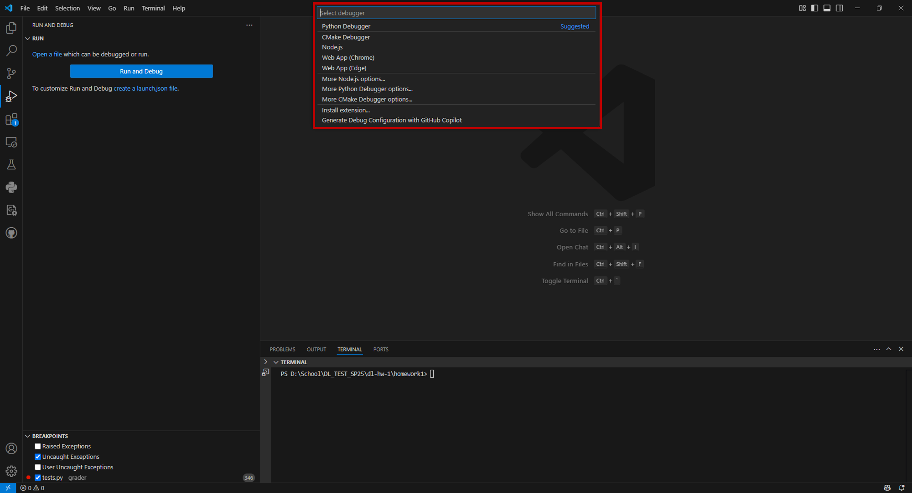
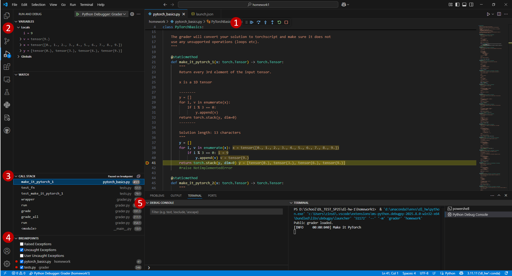
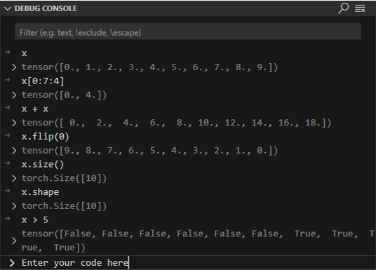
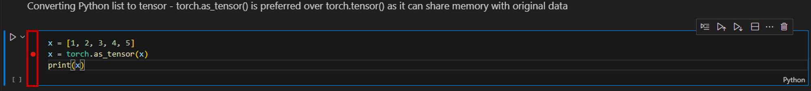
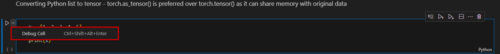

# VSCode Python Debugger Setup  :snake:
Instructions and configuration files for setting up the Python debugger in VSCode.

## Table Of Contents

- [Getting Started](#getting-started)
    - [Prerequisites](#prerequisites)
    - [Installation](#installation)
- [Debugger Setup and Configurations](#debugger-setup-and-configurations)
    - [What is launch.json](#what-is-launchjson)
    - [Creating a launch.json](#creating-a-launchjson)
    - [Useful Configurations](#useful-configurations)
    - [Enabling Break Points](#enabling-break-points)
    - [Running the Debugger](#running-the-debugger)
- [Notebook Debugging](#notebook-debugging)

## Getting Started

### Prerequisites
Have the following programs installed before continuing:
| Requirement                             | Installation                         |
| --------------------------------------- | ------------------------------------ |
| VSCode                                  | https://code.visualstudio.com/download      |
| Miniconda (Optional)                    | https://www.anaconda.com/docs/getting-started/miniconda/install#quickstart-install-instructions |

---

### Installation
The Python Debugger is included with the official Python extension for VS Code, but it is important to verify its installation.

Open the Extension tab (`Ctrl+Shift+X`) located on the left sidebar.
<!--  -->
<!-- Better formatting in my opinion-->
<p align="center">
  
</p>

Type `Python Debugger` in the searchbar.

<!--  -->
<p align="center">
  
</p>

Verify that the Python Debugger extension has been installed.

<!--  -->
<p align="center">
  
</p>


## Debugger Setup and Configurations
The VSCode debugger lets you set breakpoints, step through code, inspect variables, and interactively test functions similar to a Jupyter notebook.  Before diving into specific configurations used in this class, let's cover how the debugger is set up and managed.  

Open the Run and Debug tab (`Ctrl+Shift+D`) located on the left sidebar.
<!--  -->
<p align="center">
  
</p>


> [!NOTE]  
> The Run and Debug tab will initially ask for you to create a `launch.json` file before using the debugger, as shown above.  However, this screen will look different if the working directory already has a `launch.json` file.

---

### What is `Launch.json`
The `launch.json` file defines the configuration used by the VSCode debugger.  The `launch.json` file is located in the `.vscode` folder within the current working directory.

Below is an example configuration for running a Python module with arguments: 
```json
{
    "name": "Example Debugger Config",
    "type": "debugpy",
    "request": "launch",
    "module": "folder.file",
    "args": ["arg1", "arg2", ... , "argN-1","argN"]
}
```

| Field                             | Description                         |
| --------------------------------------- | ------------------------------------ |
| [name](https://code.visualstudio.com/docs/python/debugging#_name)                                 | Display name for the configuration shown in the VSCodeUI     |
| [type](https://code.visualstudio.com/docs/python/debugging#_type)                   | Specifies the type of debugger.  Use `debugpy` for Python debugging.|
| [request](https://code.visualstudio.com/docs/python/debugging#_request)                    | Indicates how to start debugging. Use `launch` to run a script. |
| [module](https://code.visualstudio.com/docs/python/debugging#_module)                    | Specifies the module to run and it is like using `python -m folder.file`.|
| [args](https://code.visualstudio.com/docs/python/debugging#_args)                    | List of command line arguments passed to the script. |
| [console](https://code.visualstudio.com/docs/python/debugging#_console)                    | Optional: Specifies where to display program outputs.  The default is `integratedterminal`. |

---

### Creating a `launch.json`
> [!IMPORTANT]
> Ensure that the current working directory is set to the Homework1 folder.  This can be done by opening the Explorer tab (`Ctrl+Shift+E`) and verifying that Homework1 appears as the top-level folder.


<!--  -->
<p align="center">
  
</p>


Navigate to the Run and Debug tab (`Ctrl+Shift+D`) and click the `create a launch.json file`.


<!--   -->
<p align="center">
  
</p>

A pop-up menu will appear under the Command Palette that lists installed debuggers.
<!--   -->
<p align="center">
  
</p>

Select `Python Debugger` to configure the debugger's type to `debugpy`.
<!--   -->
<p align="center">
  
</p>


Set the debug configuration to `Module`.
<!--   -->
<p align="center">
  
</p>

Replace `enter-your-module-name` with the name of the module you will be running.  For this class, we will mostly be working with the  `grader` or `homework.train` modules.
<!--   -->
<p align="center">
  
</p>

Return to the Explorer tab (`Ctrl+Shift+E`) and verify the `.vscode` folder was added to the top-level directory.
<!--   -->
<p align="center">
  
</p>

---

### Useful Configurations
<details>

<summary>Python Debugger: Grader</summary>

```json
{
    "name": "Python Debugger: Grader",
    "type": "debugpy",
    "request": "launch",
    "module": "grader",
    "args": ["homework"]
}
```
</details>

<details>

<summary>Python Debugger: Grader Verbose</summary>

```json
{
    "name": "Python Debugger: Grader Verbose",
    "type": "debugpy",
    "request": "launch",
    "module": "grader",
    "args": ["homework", "-v"]
}
```
</details>

<details>
<summary>Python Debugger: Grader Very Verbose</summary>

```json
{
    "name": "Python Debugger: Grader Very Verbose",
    "type": "debugpy",
    "request": "launch",
    "module": "grader",
    "args": ["homework", "-vv"]
}
```
</details>


<details>
<summary>Python Debugger: Train Script</summary>

```json
{
    "name": "Python Debugger: Train Script",
    "type": "debugpy",
    "request": "launch",
    "module": "homework.train",
    "args": ["--model_name", "linear", "--num_epoch", "10"]
}
```
</details>

<details>
<summary>Python Debugger: Multiple Configurations Example</summary>

```json
{
    "version": "0.2.0",
    "configurations": [

        {
            "name": "Python Debugger: Grader",
            "type": "debugpy",
            "request": "launch",
            "module": "grader",
            "args": ["homework"]
        },
        {
            "name": "Python Debugger: Train Script",
            "type": "debugpy",
            "request": "launch",
            "module": "homework.train",
            "args": ["--model_name", "linear", "--num_epoch", "10"]
        },
    ],
}
```

Use the dropdown menu next to the Run button to change configurations.
<!--   -->
<p align="center">
  
</p>


</details>

---

### Enabling Break Points
Click on the editor margin (space to the left of line numbers) to add or remove breakpoints.  Alternatively, use `F9` to add or remove a breakpoint on the current line.

<!--  -->
<p align="center">
  
</p>

> [!NOTE]  
> There are more advanced breakpoint that can be set by right-clicking on the editor margin.  Refer to the [documentation](https://code.visualstudio.com/docs/debugtest/debugging#_breakpoint-types) for more details.

> [!Warning]
> Breakpoints will be ignored if the debugger encounters a `raise NotImplementedError` line of code before reaching the desired breakpoint.

---

### Running the Debugger
Click the Run Button or press `F5` on the keyboard to run the debugger.
<!--  -->
<p align="center">
  
</p>

Several useful panels and tools will appear once the debugger starts:
<!--  -->
<p align="center">
  
</p>


| Feature                             | Description                         |
| --------------------------------------- | ------------------------------------ |
| 1. Debug Toolbar                               | Used to control the debug session with the buttons appearing in the order of Continue, Step Over, Step Into, Step Out, Restart, Stop.  Refer to [Debug Actions](https://code.visualstudio.com/docs/debugtest/debugging#_debug-actions) to learn what each button does.  |
| 2. Variables                  | Displays local and global variables available at the current breakpoint.|
| 3. Call Stack                    | Shows the sequence of function calls that led to the current point, which is useful for tracing logic. |
| 4. Breakpoints                    | Useful for enabling/disabling global and user-defined breakpoints by checking/unchecking the boxes.|
| 5. Debug Console                  | Useful for evaluating expressions and interacting with the running program similar to a notebook.  Open it via `View > Debug Console` or the shortcut (`Ctrl+Shift+Y`).    |

> [!TIP]  
> Try experimenting with the Debug Console. The image below demonstrates simple expressions evaluated in `make_it_pytorch_1`, using the variable `x`.
<!--  -->
<p align="center">
  
</p>


## Notebook Debugging
Debugging Jupyter notebooks in VSCode is straightforward and does not require a configuration file.  

### To get started:

1. **Set a breakpoint** by clicking in the editor margin next to the line of code you want to pause on.
    <p align="center">
      
    </p>
2. **Click the dropdown arrow** next to the green Run button (in the top-left corner of the cell).
    <p align="center">
      
    </p>
3. **Select "Debug Cell"** from the dropdown menu.
   <p align="center">
      
    </p>


