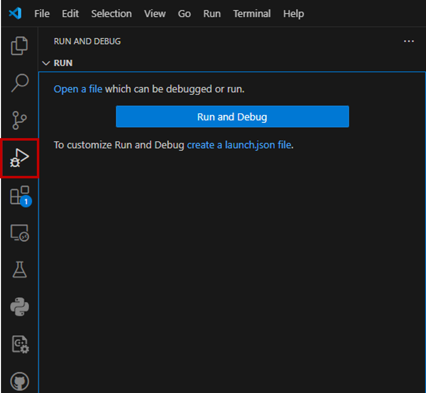

# VSCode Python Debugger Setup  :snake:
Instructions and configuration files for setting up the Python debugger in VSCode

## Table Of Contents

- [Getting Started](#getting-started)
    - [Prerequisites](#prerequisites)
    - [Installation](#installation)
- [Configurations](#configurations)
    - [Script Debugger](#script-debugger)
    - [Notebook Debugger](#notebook-debugger)
    - [Remote Debugger](#remote-debugger)

## Getting Started

### Prerequisites
Have the following programs installed before continuing:
| Requirement                             | Installation                         |
| --------------------------------------- | ------------------------------------ |
| VSCode                                  | https://code.visualstudio.com/download      |
| Miniconda (Optional)                    | https://www.anaconda.com/docs/getting-started/miniconda/install#quickstart-install-instructions |
| Colab Pro (Optional)                    | - |

### Installation
The Python Debugger is included with the official Python extension for VS Code.  
Verify its installation by:

Opening the Extension tab (`Ctrl+Shift+X`)
<!--  -->
<!-- Better formatting in my opinion-->

  

Searching for `Python Debugger` in the searchbar

<!--  -->

  

Verify that the Python Debugger extension has been installed 

<!--  -->

  

## Configurations
The VSCode debugger lets you set breakpoints, step through code, inspect variables, and interactivly test functions similar to a Jupyter notebook.  Before diving into specific configurations used in this class, let's cover how the debugger is setup and managed.  

1. Navigate to the Run and Debug tab on the sidebar - shortcut (Ctrl+Shift+D):
<!--  -->

  

2. 

#### What is `Launch.json`
Configurations used by the debugger are defined in `launch.json` file and stored in the current working directory under the `.vscode` folder. 

### Script Debugger
This section covers creating a launch.json file to run the debugger on training and grader scripts.  
python -m homework.train --model_name linear
or
python -m 

<!--  -->

  

<!--  -->

  

<!--  -->

  

<!--  -->

  

<!--  -->

  

### Notebook Debugger
### Remote Debugger

## Troubleshooting

